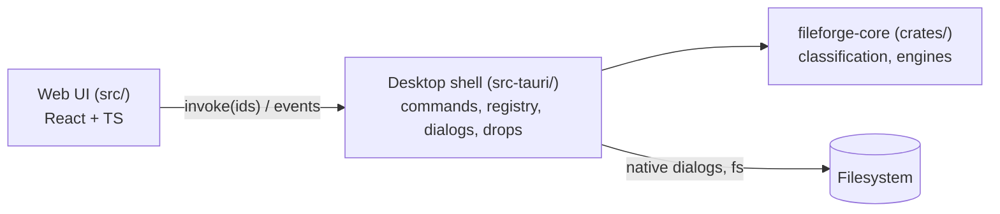

# Components

| Component | Owns | Must not |
|---|---|---|
| Web UI `src/` | Layout, state of tool panels, i18n, presentation of results | Import `@tauri-apps/*` outside `src/services/fileforgeApi.ts`; handle paths |
| Desktop shell `src-tauri/` | IPC commands, `FileRegistry` (session ids → paths), native dialogs, drop events, temp results | Contain processing logic |
| Core `crates/fileforge-core/` | `FileKind` detection, processing engines (PDF next) | Depend on `tauri` or any UI crate; touch global state |

Allowed dependency directions: UI → shell (IPC only) → core. Core depends on nothing app-specific.

Inside the shell, modules follow the import groups of the global rules: `error` (types) ← `file_registry` (state) ←
`commands`, `drag_drop` (handlers).

UI structure: `components/` shared presentational pieces; `features/` one folder per tool plus
`featureCatalog.ts`; `hooks/` shared stateful logic (`useFileIntake`, `useDragHover`, `useI18n`); `i18n/`
dictionaries; `services/` the IPC client.
