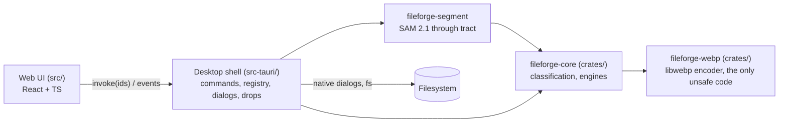

# Components

| Component | Owns | Must not |
|---|---|---|
| Web UI `src/` | Layout, state of tool panels, UI strings, presentation of results | Import `@tauri-apps/*` outside `src/services/fileforgeApi.ts`; handle paths |
| Desktop shell `src-tauri/` | IPC commands, `FileRegistry` (session ids → paths), `ResultStore` (temp results, one compression at a time), `Cancellation` and progress throttling (`job_control`), app updates (`updates`), native dialogs, drop events | Contain processing logic |
| Core `crates/fileforge-core/` | `FileKind` detection, shared `control` (cancellation, progress), PDF engine (`pdf/`: guards, metadata, dedupe, fonts, cff, placement, images, jpx, photos, streams), image engine (`raster/`: `jpeg/` segments, scans, huffman; `png`, `webp`, `exif`) | Depend on `tauri` or any UI crate; touch global state; call `libwebp-sys` |
| SAM adapter `crates/fileforge-segment/` | Hash verification, normalized image tensors, pinned ONNX graphs, owned thread pool, embeddings and mask selection | Depend on Tauri; read user files; make network requests |
| WebP encoder `crates/fileforge-webp/` | One safe function: validated RGB/RGBA pixels → WebP bytes through libwebp, stoppable; the workspace's only `unsafe` code (ADR-0020) | Decode or parse files; depend on other workspace crates |

Allowed dependency directions: UI → shell (IPC only) → core → `fileforge-webp`. Core depends on nothing app-specific. Shell → segment → core; core defines the segmenter port and never imports tract.

Inside the shell, module dependencies flow from `error` (types) ← `file_registry`,
`results`, `job_control` (state) ← `updates` (uses `results`) ← `commands`, `drag_drop` (handlers).
`background` wires core/segment to the model manager and content-keyed single-entry embedding cache.
`models` handles explicit, bounded HTTPS downloads and pinned verification.
`file_registry` uses `folder_scan` (bounded search of dropped folders, ADR-0017).

UI structure: `components/` shared presentational pieces, plus `UpdateStatus` (sidebar app updates, with its
`useUpdates` hook) and the compression layout every compression tool uses (`CompressionPanel`, `JobStatus`);
`features/` one folder per tool (settings, presets, the engine adapter for `useCompressionJobs`) plus
`featureCatalog.ts`; `hooks/` shared stateful logic (`useFileIntake`, `useDragHover`, `useCompressionJobs`);
`messages/` all UI strings; `services/` the IPC client.
